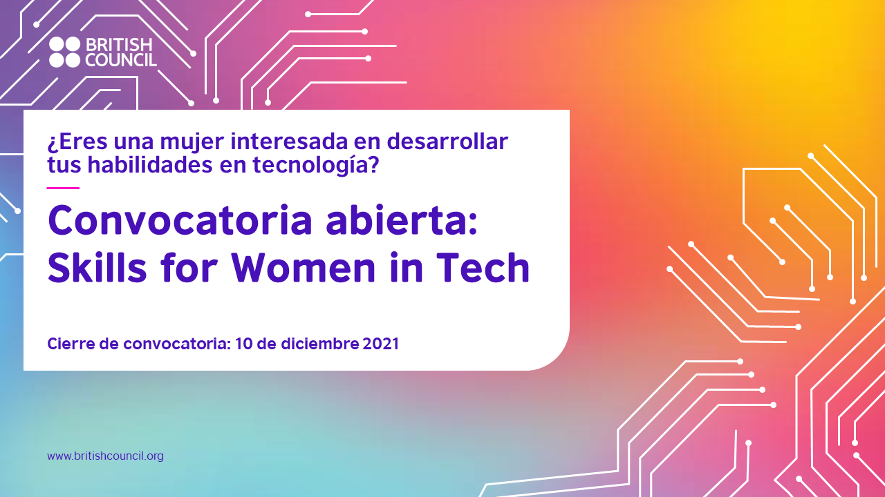

# Intro-Github

## Charla-Taller

Taller desarrollado por el **Google Developer Students Club de la Universidad de Guanajuato** en colaboración por parte del programa **SKILLS FOR WOMEN IN TECH** y junto a **BRITISH COUNCIL** para la capacitación-actualización de un grupo de estudiantes y profesores de la casa de estudios.
 Sesión de github

### Insertaremos una imagen

